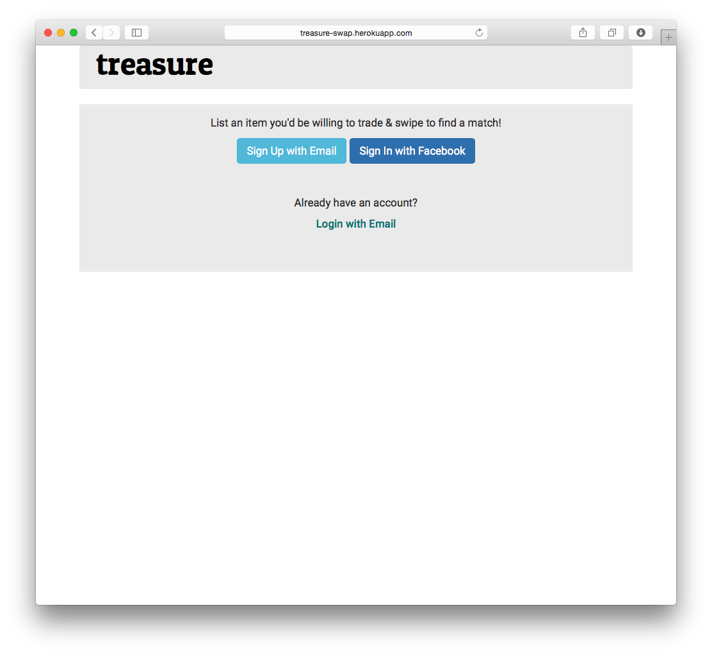

# Treasure

Ruby on Rails web application that allows you to list an item and swipe against others based on whether or not you'd be willing to trade it.

Created by [Carolina Medellin](http://github.com/caromedellin), [Darius Atmar](http://github.com/datmar), [Natalie Polen](http://github.com/nataliecodes), & [Nicola Beuscher](http://github.com/deweydell)

## Features
* Register/Login with email or Facebook

##Screenshots
###Login with email or Facebook

###List an item to trade

###Swipe right or left on other users' items

###A match is made when two users like each other's items

###In-app messages for matched items

##How to Run Our App Locally

##Future Features

