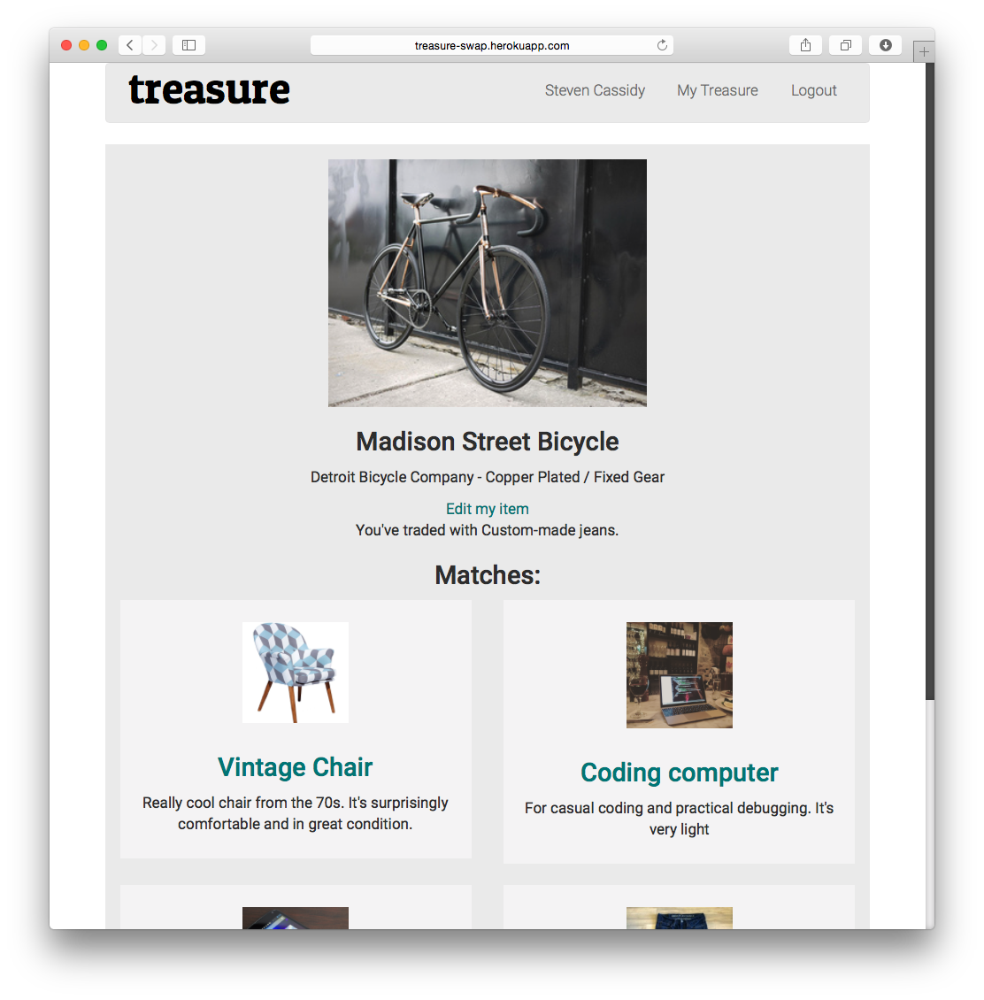
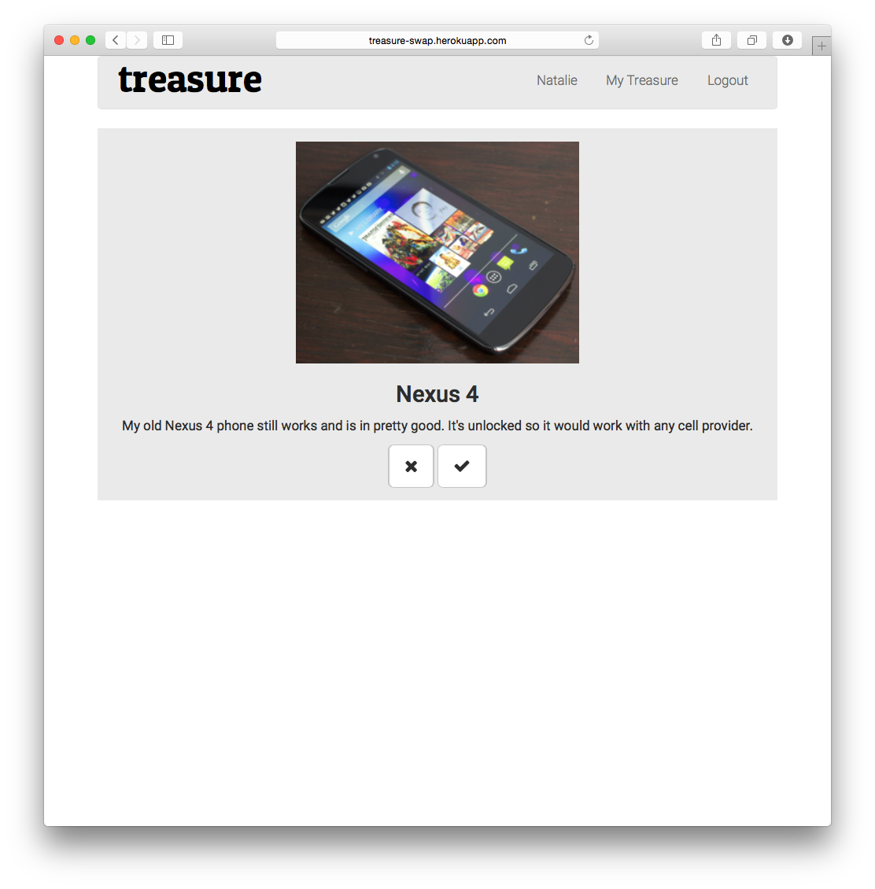
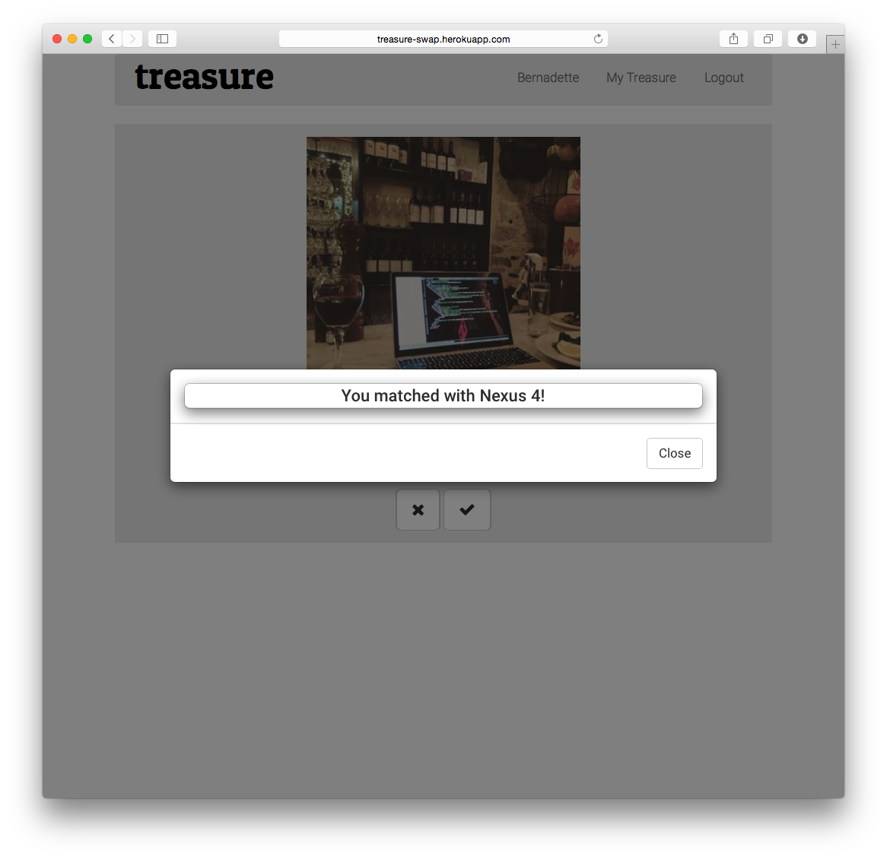
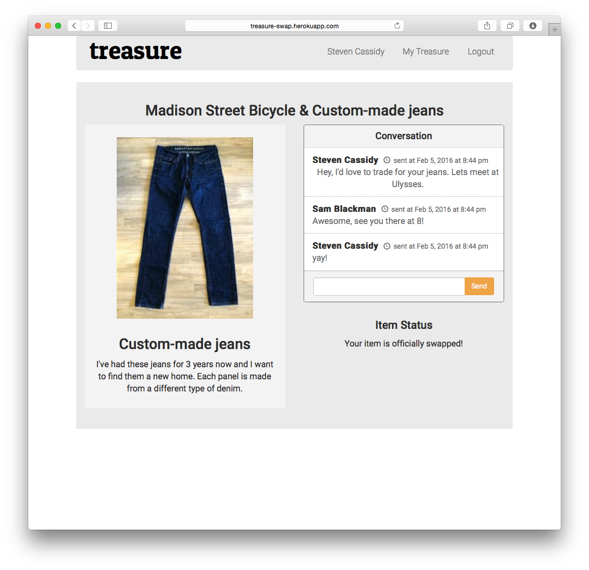

# Treasure

Ruby on Rails web application that allows you to list an item and swipe against others based on whether or not you'd be willing to trade it.

Created by [Carolina Medellin](http://github.com/caromedellin), [Darius Atmar](http://github.com/datmar), [Natalie Polen](http://github.com/nataliecodes) & [Nicola Beuscher](http://github.com/deweydell)

## Built With
Treasure is built with the following open source components:
- [Ruby on Rails](https://github.com/rails/rails)
- [PostgreSQL](http://www.postgresql.org/)
- [jQuery](http://jquery.com/)
- [OmniAuth](https://github.com/intridea/omniauth)
- [Paperclip](https://github.com/thoughtbot/paperclip)

###Dependencies
- [PostgreSQL](http://www.postgresql.org/)
- Bundler Gem ('gem install bundler')

##How to Run Our App Locally (OS X 10.8 or later)
1. In the terminal:
~~~
git clone https://github.com/deweydell/treasure.git
~~~
2. Enter the root directory and run the following commands:
~~~
bundle install
bundle exec rake db:drop && rake db:create && rake db:migrate && rake db:seed
bundle exec rails s
~~~
3. The app will now be running on localhost:
~~~
=> Booting WEBrick
=> Rails 4.2.5 application starting in development on http://localhost:3000
=> Run `rails server -h` for more startup options
=> Ctrl-C to shutdown server
~~~

##Screenshots
###List an item to trade

###Swipe right or left on other users' items

###A match is made when two users like each other's items

###In-app messaging for matched items

##Future Features
- Location-based filtering
- User ratings and reviews
- Multiple items for highly rated users
